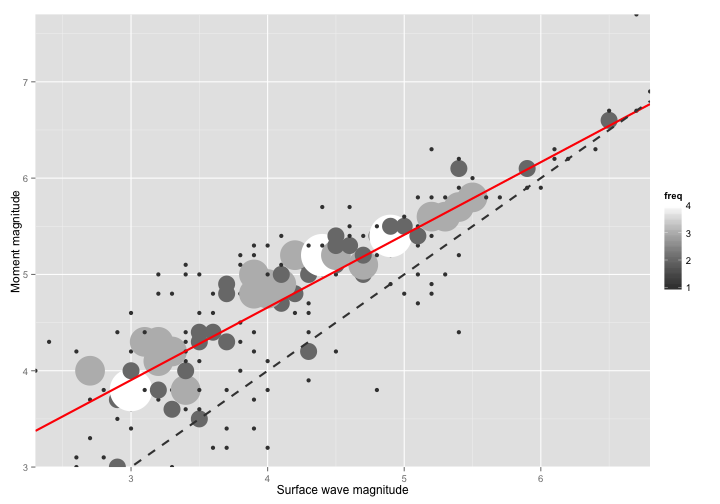

Comparison of earthquake magnitude scales
=========================================
author: Ariane
date: 25 July 2015
width: 1500

Dataset
=======

Names of the magnitude scales


```
[1] "md_L1" "md_L2" "md_L3" "mw"    "mb"    "ms"    "ml"   
```

Number of data available for each couple of magnitude scales


```
      md_L1 md_L2 md_L3   mw   mb  ms   ml
md_L1 12078  2939   269 1548 1032 539  330
md_L2  2939  7489    95   77  479 225  138
md_L3   269    95  5236   23  224 162  134
mw     1548    77    23 4119  370 253  122
mb     1032   479   224  370 3570 962  649
ms      539   225   162  253  962 966  389
ml      330   138   134  122  649 389 2588
```

Linear regression: mw = f(ms)
=============================


```r
x <- data$ms[!is.na(data$ms) & !is.na(data$mw)]
y <- data$mw[!is.na(data$ms) & !is.na(data$mw)]
freqData <- as.data.frame(table(x, y))
names(freqData) <- c("ms", "mw", "freq")
subFreqData <- subset(freqData, freq > 0)
subFreqData$ms <- as.numeric(as.character(subFreqData$ms))
subFreqData$mw <- as.numeric(as.character(subFreqData$mw))
fit <- lm(mw ~ ms, data = subFreqData, weights = freq)
coeff <- summary(fit)$coefficients
R2 <- summary(fit)$r.squared
sigma <- summary(fit)$sigma
```

Result: $M_{W}$ = 0.754(+- 0.035) $M_{S}$ + 1.64(+- 0.149)

$R^2$ = 0.73, $\sigma$ = 0.52

Computation of R2 (with bootstrap)
================================================================


```r
R2bootstrap <- function(x, y, freq, n){
  R2 <- vector(length = n)
  for (i in 1:n){
    i_app <- sample.int(length(y), size = length(y), replace = TRUE)
    i_pre <- c(1:length(y))[!c(1:length(y)) %in% i_app]
    app <- data.frame(y = y[i_app], x = x[i_app], freq = freq[i_app])
    pre <- data.frame(y = y[i_pre], x = x[i_pre], freq = freq[i_pre])
    fit <- lm(y ~ x, data = app, weights = freq)
    yhat <- predict(fit, pre)
    R2[i] <- 1-sum((pre$y-yhat)^2)/sum((pre$y-mean(pre$y))^2)
  }
  return(mean(R2))
}
R2boot <- R2bootstrap(subFreqData$ms, subFreqData$mw, subFreqData$freq, 50)
```

Graph
========================================================

 

***

The red line is the result from our linear regression.

The R2 computed with the bootstrap method is equal to 0.682
