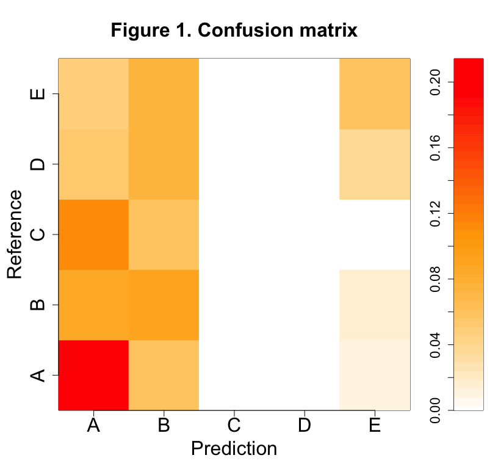
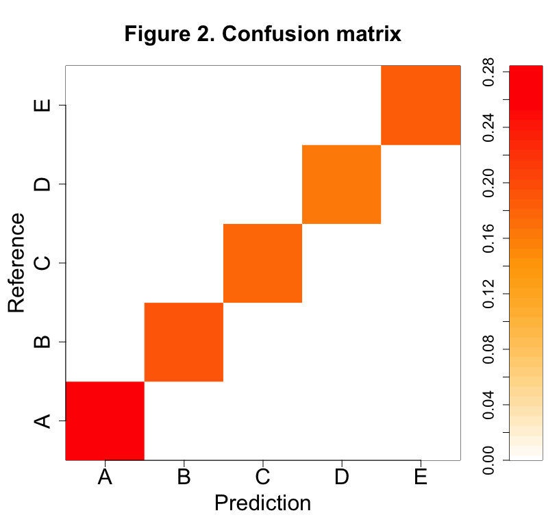

# Weight Lifting Exercise

## Summary

The aim of this project is to build a machine learning algorithm to predict the manner in which six participants did a barbell lifts exercise, using data from accelerometers on their belt, forearm, arm, and dumbell. The participants could do the exercise in five differents ways (labelled "A" to "E").

## Preprocessing

First, I look at the data: we have 160 columns. The last one ("classe") corresponds to the way in which the participants did the exercise. This is the variable I want to predict.


```r
set.seed(1)
library(caret)
setwd("/Users/ariane/Documents/Travail/Coursera/DataScience/PracticalMachineLearning/")
training <- read.csv("pml-training.csv", na.strings=c("", "NA"))
testing <- read.csv("pml-testing.csv", na.strings=c("", "NA"))
```

Many variables have a lot of empty raws (empty line or "NA"). I won't keep these variables for my prediction. The variable "user_name" is the name of the participants, and the variable "num_window" seems to correspond to the index of the time window during which the exercise was recorded. These two variables seem interesting, therefore I will keep them for the prediction and assume that they are factor variables. The first variable ("X") is the index of the row. It does not seem very useful, so I won't keep it in my data set. I am not sure of the meaning of the variables "raw_timestamp_part_1", "raw_timestamp_part_2", "cvtd_timestamp" and "new_window". Therefore, I won't keep them in my data set.


```r
nbNA <- vector(length=160)
for (i in 1:160){nbNA[i] <- sum(is.na(training[, i]))}
keep <- c(1:160)[nbNA == 0]
keep <- keep[keep >= 8]
training2 <- data.frame(user_name=as.factor(training$user_name), num_window=as.factor(training$num_window), training[, keep])
testing2 <- data.frame(user_name=as.factor(testing$user_name), num_window=as.factor(testing$num_window), testing[, keep])
```

I still have 52 variables in my data set, which seems a bit too much. Therefore, I will perform a Principal Components Analysis, and I will keep only the variables that explain 80 % of the variance. I have now only 12 variables.


```r
preProc <- preProcess(training2[, -c(1, 2, 55)], method="pca", thresh=0.80)
training3 <- predict(preProc, training2[, -c(1, 2, 55)])
training4 <- data.frame(user_name=training2$user_name, num_window=training2$num_window, training3, classe=training2$classe)
testing3 <- predict(preProc, testing2[, -c(1, 2, 55)])
testing4 <- data.frame(user_name=testing2$user_name, num_window=testing2$num_window, testing3)
```

## Modeling

I will try several models. Using the caret package, I first try to use classification trees with the method "rpart" of the function "train".


```r
#model1 <- train(classe ~ ., method="rpart", data=training4)
#pred1 <- predict(model1, newdata=training4)
#matrix1 <- confusionMatrix(pred1, training4$classe)$table
```

The corresponding confusion matrix is given in Figure 1

 

The results are not very good. I now try to use Support Vector Machines with the method "svmLinear" of the function "train".


```r
#model2 <- train(classe ~ ., method="svmLinear", data=training4)
#pred2 <- predict(model2, newdata=training4)
#matrix2 <- confusionMatrix(pred2, training4$classe)$table
```

The corresponding confusion matrix is given in Figure 2

 

The results are now much better. To check the out-of-sample error, I use cross-validation.


```r
#folds <- createFolds(y=training4$classe, k=10, list=TRUE, returnTrain=TRUE)
#predCV <- vector(length=dim(training4)[1])
#for (i in 1:10){
#    model0 <- train(classe ~ ., method="svmLinear", data=training4[folds[[i]],])
#    pred0 <- predict(model0, newdata=training4[-folds[[i]],])
#    predCV[-folds[[i]]] <- pred0
#}
#predCV[predCV == 1] <- "A"
#predCV[predCV == 2] <- "B"
#predCV[predCV == 3] <- "C"
#predCV[predCV == 4] <- "D"
#predCV[predCV == 5] <- "E"
#matrix0 <- confusionMatrix(predCV, training4$classe)$table
```

The corresponding confusion matrix is given in Figure 3

 

The out-of-sample error seems very low. I think the model is now good enough and I will try the prediction with the testing data set.

## Prediction


```r
#answers <- predict(model0, newdata=testing4)
#pml_write_files = function(x){
#    n = length(x)
#        for (i in 1:n){
#        filename = paste0("problem_id_", i, ".txt")
#        write.table(x[i], file=filename, quote=FALSE, row.names=FALSE, col.names=FALSE)
#    }
#}
#pml_write_files(answers)
```
