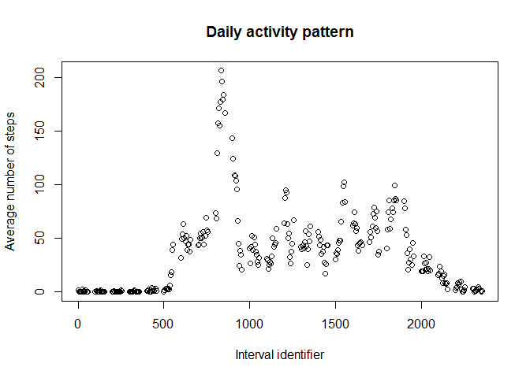
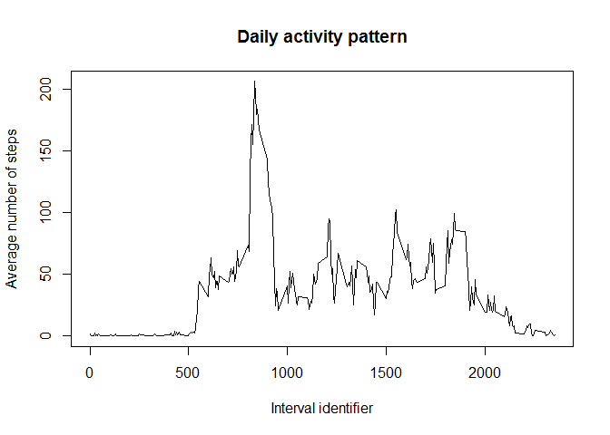

# Reproducible Research - Assignment 1
Ariane  
Friday, August 15, 2014  

We study data from a personal activity monitoring device. This device collects data at 5 minute intervals through out the day. The data consists of two months of data from an anonymous individual collected during the months of October and November, 2012 and include the number of steps taken in 5 minute intervals each day.The data set contains three variables:

- steps: Number of steps taking in a 5-minute interval (missing values are coded as NA)
- date: The date on which the measurement was taken in YYYY-MM-DD format
- interval: Identifier for the 5-minute interval in which measurement was taken

We begin by loading the data:


```r
setwd("D:/Travail/Coursera/DataScience/ReproducibleResearch/Assignment1")
data <- read.csv("activity.csv")
```

What is mean total number of steps taken per day?
-------------------------------------------------

To answer this question, we make a histogram of the total number of steps taken each day, ignoring the missing values in the dataset. Then, we calculate the mean and the median of the total number of steps taken per day.


```r
nb_steps <- tapply(data$steps, as.factor(data$date), sum)
hist(nb_steps, main="Total number of steps taken each day", xlab="Number of steps", ylab="Frequency")
```

 

```r
mean(nb_steps, na.rm=TRUE)
```

```
## [1] 10766
```

```r
median(nb_steps, na.rm=TRUE)
```

```
## [1] 10765
```

What is the average daily activity pattern?
-------------------------------------------

To answer this question, we make a time series plot of the 5-minute intervals and the average number of steps taken, averaged across all days. We look for the 5-minute interval, on average across all the days in the dataset, that contains the maximum number of steps.


```r
nb_steps <- tapply(data$steps, as.factor(data$interval), mean, na.rm=TRUE)
plot(levels(as.factor(data$interval)), nb_steps, main="Daily activity pattern", xlab="Interval identifier", ylab="Average number of steps")
```

 

```r
levels(as.factor(data$interval))[which(nb_steps==max(nb_steps))]
```

```
## [1] "835"
```

Imputing missing values
-----------------------

To fill the missing values in the dataset, we replace each missing value by the average value across all day of the corresponding 5-minute interval. Then, we define a second dataset where the missing values of the first dataset are filled. We make a histogram of the total number of steps taken each day, with the new dataset, and we calculate the mean and the median of the total number of steps taken per day. We compare the values obtained with the estimates from the first part of the assignment.


```r
steps_fill <- data$steps
mean_steps <- tapply(data$steps, as.factor(data$interval), mean, na.rm=TRUE)
for (i in 1:length(levels(as.factor(data$interval))))
{
    steps_fill[is.na(data$steps) & data$interval==levels(as.factor(data$interval))[i]] <- mean_steps[i]
}
data2 <- data.frame(steps=steps_fill,date=data$date,interval=data$interval)
nb_steps <- tapply(data2$steps, as.factor(data2$date), sum)
hist(nb_steps, main="Total number of steps taken each day", xlab="Number of steps", ylab="Frequency")
```

 

```r
head(data2)
```

```
##     steps       date interval
## 1 1.71698 2012-10-01        0
## 2 0.33962 2012-10-01        5
## 3 0.13208 2012-10-01       10
## 4 0.15094 2012-10-01       15
## 5 0.07547 2012-10-01       20
## 6 2.09434 2012-10-01       25
```

```r
mean(nb_steps, na.rm=TRUE)
```

```
## [1] 10766
```

```r
median(nb_steps, na.rm=TRUE)
```

```
## [1] 10766
```

These values do not differ much from the estimates from the first part of the assignment. The mean is a same, while the median is a bit larger. The impact of imputing missing data increases the estimates of the total daily number of steps.

Are there differences in activity patterns between weekdays and weekends?
-------------------------------------------------------------------------

To answer this question, we create a new factor variable in the dataset with two levels (???weekday??? and ???weekend???) indicating whether a given date is a weekday or weekend day. Then, we make a panel plot containing a time series plot of the 5-minute interval and the average number of steps taken, averaged across all weekday days or weekend days. 


```r
week <- weekdays(as.Date(data2$date))
week[week=="lundi"] <- "weekday"
week[week=="mardi"] <- "weekday"
week[week=="mercredi"] <- "weekday"
week[week=="jeudi"] <- "weekday"
week[week=="vendredi"] <- "weekday"
week[week=="samedi"] <- "weekend"
week[week=="dimanche"] <- "weekend"
data2$day <- as.factor(week)

data_weekday <- subset(data2, data2$day=="weekday")
data_weekend <- subset(data2, data2$day=="weekend")

nb_steps1 <- tapply(data_weekday$steps, as.factor(data_weekday$interval), mean, na.rm=TRUE)
nb_steps2 <- tapply(data_weekend$steps, as.factor(data_weekend$interval), mean, na.rm=TRUE)

oldpar <- par(mfrow=c(2, 1))
par(mfg=c(1, 1, 2, 1))
plot(levels(as.factor(data_weekend$interval)), nb_steps2, type="l", main="Weekend", xlab="Interval identifier", ylab="Average number of steps")
par(mfg=c(2, 1, 2, 1))
plot(levels(as.factor(data_weekday$interval)), nb_steps1, type="l", main="Week days", xlab="Interval identifier", ylab="Average number of steps")
```

 

The activity pattern of weekdays is clearly different from the activity pattern of weekends.
