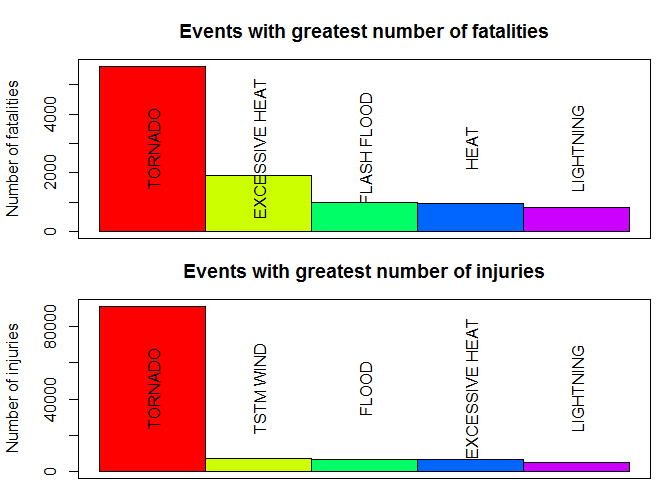
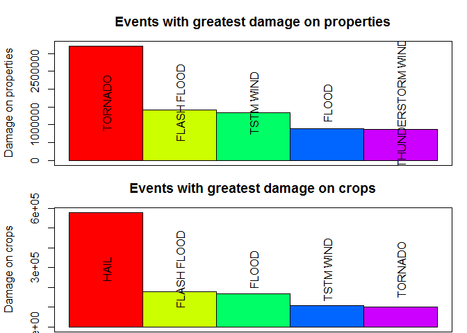

# Tornadoes are the most harmful weather events in the USA

Synopsis
--------
To determine which types of weather events are the most harmful with respect to population health, and which types of weather events have the greatest economic consequences, we use the U.S. National Oceanic and Atmospheric Administration's (NOAA) storm database. We read the data file and keep only the events for which some casualties or damage are reported. As there are a great number of denominations of weather events, we keep only the types of events which are often reported. We must not neglect an event that occurred only once but was very harmful; therefore, we keep the events for which the damage was higher than the 95th percentile. To determine which types of events are harmful, we multiply the damage caused by a type of event by the number of times that this type of event occurred. We then keep the five most harmful types of events for each indicator considered (fatalities, injuries, damage to properties, damage to crops).

Data Processing
---------------

We begin by reading the data file. We check what are the data reported in the data file, and how many events we have in the data base.


```r
data<-read.csv("D:/Travail/Coursera/DataScience/ReproducibleResearch/Assignment2/repdata_data_StormData.csv")
names(data)
```

```
##  [1] "STATE__"    "BGN_DATE"   "BGN_TIME"   "TIME_ZONE"  "COUNTY"    
##  [6] "COUNTYNAME" "STATE"      "EVTYPE"     "BGN_RANGE"  "BGN_AZI"   
## [11] "BGN_LOCATI" "END_DATE"   "END_TIME"   "COUNTY_END" "COUNTYENDN"
## [16] "END_RANGE"  "END_AZI"    "END_LOCATI" "LENGTH"     "WIDTH"     
## [21] "F"          "MAG"        "FATALITIES" "INJURIES"   "PROPDMG"   
## [26] "PROPDMGEXP" "CROPDMG"    "CROPDMGEXP" "WFO"        "STATEOFFIC"
## [31] "ZONENAMES"  "LATITUDE"   "LONGITUDE"  "LATITUDE_E" "LONGITUDE_"
## [36] "REMARKS"    "REFNUM"
```

```r
dim(data)
```

```
## [1] 902297     37
```

We keep only the events for which casualties are reported, or damage is reported. We check how many events are left in the new data sets.


```r
data_cas <- subset(data, data$FATALITIES > 0 | data$INJURIES > 0)
dim(data_cas)
```

```
## [1] 21929    37
```

```r
data_dam <- subset(data, data$PROPDMG > 0 | data$CROPDMG > 0)
dim(data_dam)
```

```
## [1] 245031     37
```

As there are a great number of denominations of weather events, we want to keep only the most significant. We count how many times each type of event appears in the new data sets.


```r
type_cas <- as.factor(data_cas$EVTYPE)
nb_cas <- rep(0,length(levels(type_cas)))
for(i in 1:length(nb_cas)){
    data_sub <- subset(data_cas, data_cas$EVTYPE==levels(type_cas)[i])
    nb_cas[i] <- dim(data_sub)[1]
}

type_dam <- as.factor(data_dam$EVTYPE)
nb_dam <- rep(0,length(levels(type_dam)))
for(i in 1:length(nb_dam)){
    data_sub <- subset(data_dam, data_dam$EVTYPE==levels(type_dam)[i])
    nb_dam[i] <- dim(data_sub)[1]
}
```

We keep only the types of events that occurred more than ten times.


```r
data_cas1 <- subset(data_cas, data_cas$EVTYPE %in% levels(type_cas)[nb_cas>=10])
data_dam1 <- subset(data_dam, data_dam$EVTYPE %in% levels(type_dam)[nb_dam>=10])
```

We also want to keep events that occurred only once or twice, but caused a lot of casualties or damage. We look at a summary of the new data sets, and keep the events for which the casulaties or the damage were higher than the 95th percentile, but occurred less than ten times.


```r
summary(data_cas$FATALITIES)
```

```
##    Min. 1st Qu.  Median    Mean 3rd Qu.    Max. 
##     0.0     0.0     0.0     0.7     1.0   583.0
```

```r
summary(data_cas$INJURIES)
```

```
##    Min. 1st Qu.  Median    Mean 3rd Qu.    Max. 
##     0.0     1.0     1.0     6.4     3.0  1700.0
```

```r
summary(data_dam$PROPDMG)
```

```
##    Min. 1st Qu.  Median    Mean 3rd Qu.    Max. 
##       0       2       8      44      25    5000
```

```r
summary(data_dam$CROPDMG)
```

```
##    Min. 1st Qu.  Median    Mean 3rd Qu.    Max. 
##     0.0     0.0     0.0     5.6     0.0   990.0
```

```r
fat95 <- quantile(data_cas$FATALITIES, 0.95)
inj95 <- quantile(data_cas$INJURIES, 0.95)
pdm95 <- quantile(data_dam$PROPDMG, 0.95)
cdm95 <- quantile(data_dam$CROPDMG, 0.95)

data_cas2 <- subset(data_cas, data_cas$EVTYPE %in% levels(type_cas)[nb_cas<10]
    & (data_cas$FATALITIES > fat95 | data_cas$INJURIES > inj95))
data_dam2 <- subset(data_dam, data_dam$EVTYPE %in% levels(type_dam)[nb_dam<10]
    & (data_dam$PROPDMG > pdm95 | data_dam$CROPDMG > cdm95))
```

We merge the two types of events.


```r
data1 <- rbind(data_cas1, data_cas2)
data2 <- rbind(data_dam1, data_dam2)
```

We make a table with the number of fatalities, the type of event, and the number of times that one particular type of event caused one particular number of fatalities. We do the same for the injuries, the damage on properties, and the damage on crops.


```r
tab_fat<- table(data1$FATALITIES, data1$EVTYPE)
col_fat <- colSums(tab_fat)
tab_fat <- tab_fat[,col_fat>0]
tab_inj<- table(data1$INJURIES, data1$EVTYPE)
col_inj <- colSums(tab_inj)
tab_inj <- tab_inj[,col_inj>0]
tab_pdm<- table(data2$PROPDMG, data2$EVTYPE)
col_pdm <- colSums(tab_pdm)
tab_pdm <- tab_pdm[,col_pdm>0]
tab_cdm<- table(data2$CROPDMG, data2$EVTYPE)
col_cdm <- colSums(tab_cdm)
tab_cdm <- tab_cdm[,col_cdm>0]
```

To get the total number of fatalities caused by one type of event, we multiply the number of times that this event occurred by the number of fatalities it has caused.


```r
nb_fat <- as.numeric(dimnames(tab_fat)[[1]])
nb_inj <- as.numeric(dimnames(tab_inj)[[1]])
nb_pdm <- as.numeric(dimnames(tab_pdm)[[1]])
nb_cdm <- as.numeric(dimnames(tab_cdm)[[1]])

total_fat <- as.vector(nb_fat %*% tab_fat)
total_inj <- as.vector(nb_inj %*% tab_inj)
total_pdm <- as.vector(nb_pdm %*% tab_pdm)
total_cdm <- as.vector(nb_cdm %*% tab_cdm)
```

We keep only the five types of events that caused the highest number of fatalities.


```r
fat_sorted <- sort.int(total_fat, index.return=TRUE, decreasing=TRUE)
inj_sorted <- sort.int(total_inj, index.return=TRUE, decreasing=TRUE)
pdm_sorted <- sort.int(total_pdm, index.return=TRUE, decreasing=TRUE)
cdm_sorted <- sort.int(total_cdm, index.return=TRUE, decreasing=TRUE)

data_fat <- data.frame(event=dimnames(tab_fat)[[2]][fat_sorted$ix[1:5]],
    number=total_fat[fat_sorted$ix[1:5]], type=rep("Fatalities", 5))
data_inj <- data.frame(event=dimnames(tab_inj)[[2]][inj_sorted$ix[1:5]],
    number=total_inj[inj_sorted$ix[1:5]], type=rep("Injuries", 5))
data_pdm <- data.frame(event=dimnames(tab_pdm)[[2]][pdm_sorted$ix[1:5]],
    number=total_pdm[pdm_sorted$ix[1:5]], type=rep("Property damage", 5))
data_cdm <- data.frame(event=dimnames(tab_cdm)[[2]][cdm_sorted$ix[1:5]],
    number=total_cdm[cdm_sorted$ix[1:5]], type=rep("Crops damage", 5))
```

Results
-------

We draw a diagram of the five most harmful types of events, with the corresponding total number of fatalities and injuries caused by these types of events.


```r
oldpar <- par(mfrow=c(2,1))

par(mfg=c(1, 1, 2, 1), mar=c(0, 4, 3, 1) + 0.1, xaxt="n")
plot("n", xlim=c(0, 5), ylim=c(0, max(data_fat$number)), xlab="", ylab="")
```

```
## Warning: NAs introduced by coercion
```

```r
par(new=TRUE)
rect(c(0:4), rep(0, 5), c(1:5), data_fat$number, col=rainbow(5))
text(0.5 + c(0:4), rep(0.5 * max(data_fat$number), 5), data_fat$event, srt=90)
title(main="Events with greatest number of fatalities", ylab="Number of fatalities")

par(mfg=c(2, 1, 2, 1), mar=c(0, 4, 3, 1) + 0.1, xaxt="n")
plot("n", xlim=c(0, 5), ylim=c(0, max(data_inj$number)), xlab="", ylab="")
```

```
## Warning: NAs introduced by coercion
```

```r
par(new=TRUE)
rect(c(0:4), rep(0, 5), c(1:5), data_inj$number, col=rainbow(5))
text(0.5 + c(0:4), rep(0.5 * max(data_inj$number), 5), data_inj$event, srt=90)
title(main="Events with greatest number of injuries", ylab="Number of injuries")
```

 

We can see that tornado, heat, flood, wind and lightning are the types of weather events that are most harmful with respect to population health.

We draw a diagram of the five most harmful types of events, with the corresponding total number of damage on properties and damage on crops caused by these types of events.


```r
oldpar <- par(mfrow=c(2,1))

par(mfg=c(1, 1, 2, 1), mar=c(0, 4, 3, 1) + 0.1, xaxt="n")
plot("n", xlim=c(0, 5), ylim=c(0, max(data_pdm$number)), xlab="", ylab="")
```

```
## Warning: NAs introduced by coercion
```

```r
par(new=TRUE)
rect(c(0:4), rep(0, 5), c(1:5), data_pdm$number, col=rainbow(5))
text(0.5 + c(0:4), rep(0.5 * max(data_pdm$number), 5), data_pdm$event, srt=90)
title(main="Events with greatest damage on properties", ylab="Damage on properties")

par(mfg=c(2, 1, 2, 1), mar=c(0, 4, 3, 1) + 0.1, xaxt="n")
plot("n", xlim=c(0, 5), ylim=c(0, max(data_cdm$number)), xlab="", ylab="")
```

```
## Warning: NAs introduced by coercion
```

```r
par(new=TRUE)
rect(c(0:4), rep(0, 5), c(1:5), data_cdm$number, col=rainbow(5))
text(0.5 + c(0:4), rep(0.5 * max(data_cdm$number), 5), data_cdm$event, srt=90)
title(main="Events with greatest damage on crops", ylab="Damage on crops")
```

 

We can see that tornado, hail, flood and wind are the types of weather events that have the greatest economic consequences.
